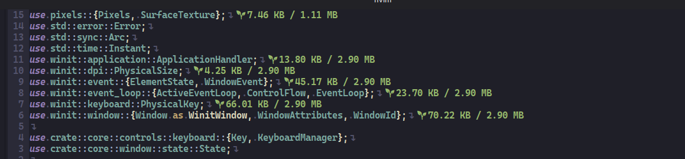
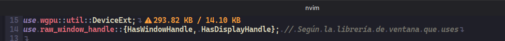
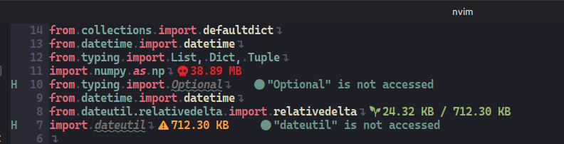
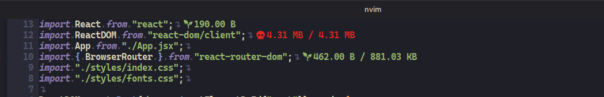
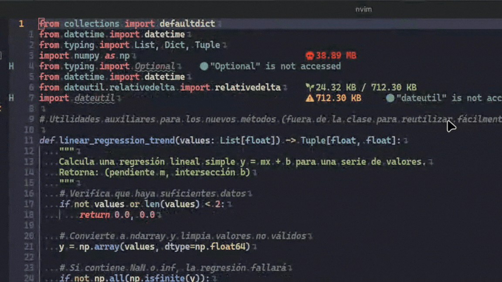

<h1 align="center">weight-balance.nvim</h1>

<p align="center">An asynchronous dependency analysis plugin for Neovim</p>

<p align="center">
 
 
 
 
 
</p>

An asynchronous Neovim plugin that calculates and displays the disk size of your dependencies and imports in real time, directly inside the editor using virtual text.







## Purpose

Modern software development relies heavily on external libraries and packages. **weight-balance.nvim** provides instant visibility into the actual footprint of your dependencies as you write code.

It calculates the disk size of imported dependencies and displays the result directly next to your imports, helping you quickly identify potentially heavy dependencies without leaving your editor.

The plugin is designed to remain lightweight and responsive by performing its analysis asynchronously through Neovim's native APIs.

## Requirements

- **Neovim** >= 0.10.0 (uses `vim.system`)
- **Python** 3.x (used internally for parsing imports and calculating package sizes)

## Features

### Current Features

- [x] **Python support** — Analyzes imported modules and third-party packages.
- [x] **Rust support** — Calculates the disk size of imported crates.
- [x] **JavaScript / TypeScript support** — Calculates the size of Node.js packages.
- [x] **JSX / TSX support** — Fully supports React component files.
- [x] **Lua support** — Analyzes imports from local and external modules.
- [x] **Normalized virtual text** — Automatically aligns virtual text indicators based on the longest import line in the buffer.
- [x] **Smart caching** — Avoids redundant calculations by tracking buffer checksums.

### Roadmap

- [ ] **Expand language support:**

  - **Go** — `import` statements and `go.mod` dependency analysis.
  - **C / C++** — `#include` directives for libraries and local/external headers.
  - **C#** — `using` statements and NuGet references.
  - **Java / Kotlin** — `import` statements and Maven/Gradle dependency management.
  - **PHP** — `require`, `include`, and Composer packages.
  - **Ruby** — `require` and Gemfile dependencies.

- [ ] **Image dependency analysis** — Detect, resolve, and calculate the disk size of image files referenced within projects, with support for formats such as PNG, JPEG, WEBP, SVG, and GIF.

## Installation

### lazy.nvim

```lua
{
    "EddyBel/weight-balance.nvim",
    ft = { "python", "javascript", "javascriptreact", "typescript", "typescriptreact", "rust", "lua" },
    opts = {},
}
```

### packer.nvim

```lua
use {
    "EddyBel/weight-balance.nvim",
    config = function()
        require("weight-balance").setup()
    end
}
```

### Native Packages (`vim.packadd`)

```lua
-- Install and load the plugin natively with vim.pack
vim.pack.add({ 'https://github.com/EddyBel/weight-balance.nvim', })
```

Then add the following to your `init.lua`:

```lua
require("weight-balance").setup()
```

## Configuration

You can customize thresholds, icons, enabled filetypes, and virtual text behavior through the `setup()` function:

```lua
require("weight-balance").setup({
    auto_check = true,
    enabled_typefiles = {
        "python",
        "javascript",
        "javascriptreact",
        "typescript",
        "typescriptreact",
        "rust",
        "lua"
    },
    virtualtext = {
        normalized = true,
        thresholds = {
            warning = 100 * 1024,      -- 100 KB
            danger = 1 * 1024 * 1024,  -- 1 MB
        },
        icons = {
            low = " ",
            warning = " ",
            danger = "󰸕 ",
            not_found = "󰒲 ",
        },
        highlights = {
            low = "DiagnosticOk",
            warning = "DiagnosticWarn",
            danger = "DiagnosticError",
            not_found = "Comment",
        },
    },
})
```

### Configuration Options

- **`auto_check`** (`boolean`) — Enables or disables automatic background analysis. When set to `true`, the plugin automatically scans buffers on `BufEnter`, `TextChanged`, and `TextChangedI`.

- **`enabled_typefiles`** (`table`) — A list of Neovim filetypes for which the plugin is enabled.

- **`virtualtext.normalized`** (`boolean`) — When `true`, aligns all virtual text indicators using the longest import line in the buffer. When `false`, places each indicator immediately after its corresponding import.

- **`virtualtext.thresholds`** (`table`) — Defines the byte thresholds used to determine the dependency size state:

  - `warning` — Size threshold at which the dependency is marked as a warning. Default: 100 KB.
  - `danger` — Size threshold at which the dependency is marked as critical. Default: 1 MB.

- **`virtualtext.icons`** (`table`) — Custom glyphs displayed next to the calculated dependency size for each state (`low`, `warning`, `danger`, `not_found`).

- **`virtualtext.highlights`** (`table`) — Neovim highlight groups used to style the virtual text for each dependency size state.

## Commands

- **`:CheckDeps`** — Runs a manual dependency analysis and prints information about the processed dependencies to the console.

## Contributing

Contributions, bug reports, feature requests, and pull requests are welcome!

If you find a bug or have an idea for improving the plugin, feel free to open an issue or submit a pull request on GitHub.

## License

This project is open-source software licensed under the [MIT](https://www.google.com/search?q=LICENSE) license.

---

<p align="center">
  <a href="https://github.com/EddyBel" target="_blank">
    
  </a>
  <a href="https://www.linkedin.com/in/eduardo-rangel-eddybel/" target="_blank">
    
  </a>
</p>
